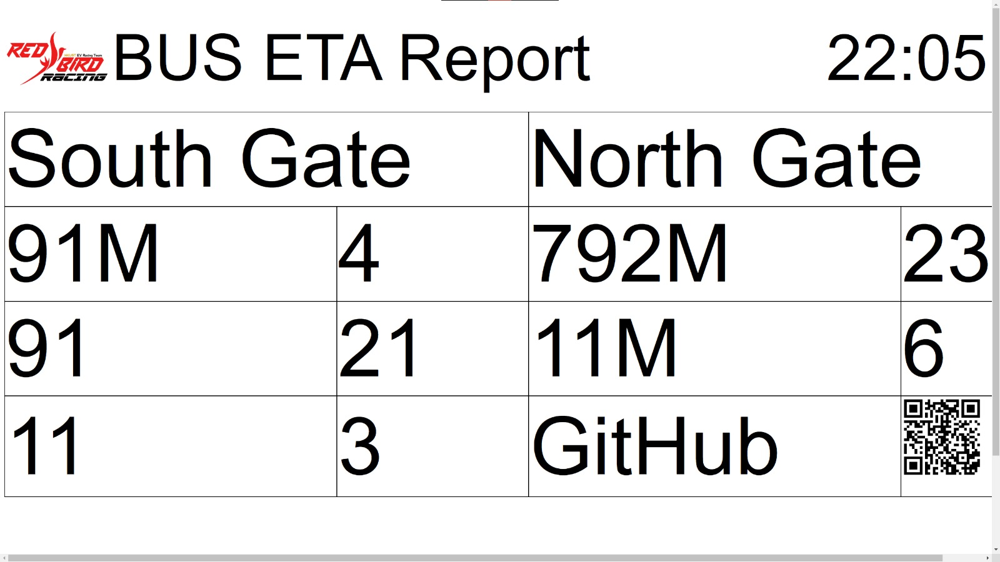

# Bus ETA Report for Hall 8 lab

This was made because it was annoying to take out phone and check how long until bus arrives and then run up when it was too late. With this, I can be constantly reminded when to leave the lab.

First project by side project and yapping sub team.

Made by marco lk network and Nicholas did some shit to it
**Screenshot**

Meant to be used on a 1080p monitor, but the screenshot was taken with a 1440p monitor.

Clock function coming soon

Citybus shit
<https://www.citybus.com.hk/datagovhk/bus_eta_api_specifications.pdf>
<https://www.citybus.com.hk/datagovhk/bus_eta_data_dictionary.pdf>

KMB shit
<https://data.etabus.gov.hk/datagovhk/kmb_eta_api_specification.pdf>
<https://data.etabus.gov.hk/datagovhk/kmb_eta_data_dictionary.pdf>

GMB shit
<https://data.etagmb.gov.hk/static/GMB_ETA_API_Specification.pdf>
